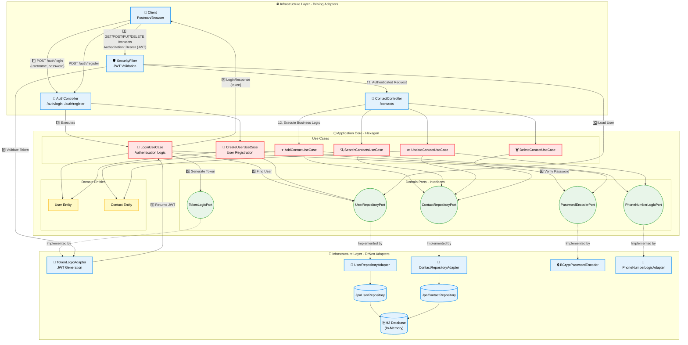

# Networker API (v1.0.0)


---

## 📋 Sobre o Projeto

**Networker API** é uma API RESTful robusta e escalável projetada para gestão de contatos profissionais, construída com foco em arquitetura limpa e boas práticas de engenharia de software.

### Arquitetura e Princípios

Esta versão **v1.0.0** estabelece os fundamentos arquiteturais do projeto, implementando:

- **Arquitetura Hexagonal (Ports & Adapters)**: O domínio da aplicação está completamente isolado de frameworks e infraestrutura, garantindo alta coesão e baixo acoplamento.

- **Clean Architecture**: As regras de negócio residem no núcleo da aplicação, totalmente desacopladas de detalhes de implementação como banco de dados, frameworks web ou bibliotecas externas.

- **Inversão de Dependência**: As camadas de infraestrutura dependem das abstrações definidas no domínio, nunca o contrário.

### Stack Técnico

- **Java 21**: Utilizando as features mais recentes da plataforma.
- **Spring Boot 4**: Framework base para orquestração de componentes.
- **Spring Security 6**: Implementação de autenticação e autorização com JWT (Stateless).
- **H2 Database**: Banco de dados em memória para desenvolvimento ágil na v1.0.0.
- **JWT (JSON Web Tokens)**: Autenticação stateless para escalabilidade horizontal.

### Estratégia de Persistência

Na **v1.0.0**, a persistência é realizada através do **H2 Database** para facilitar o desenvolvimento e testes. No entanto, graças à arquitetura hexagonal implementada, a troca de adapters de persistência é trivial - basta implementar as interfaces de porta (ports) definidas no domínio.

---

## 📐 Design Arquitetural

A **Networker API** implementa rigorosamente a **Arquitetura Hexagonal** (Ports & Adapters), garantindo total isolamento entre o núcleo de negócio e detalhes de infraestrutura. O diagrama abaixo ilustra a separação de responsabilidades e o fluxo de dados através das camadas.



### 🔑 Fluxo de Autenticação JWT

1. **Login (Geração do Token)**:
   - Cliente envia credenciais para `POST /auth/login`
   - `LoginUseCase` valida as credenciais através das portas `UserRepositoryPort` e `PasswordEncoderPort`
   - `TokenLogicPort` (implementado por `TokenLogicAdapter`) gera o JWT com claims do usuário
   - Token é retornado ao cliente na resposta

2. **Acesso a Rotas Protegidas** (ex: `/contacts`):
   - Cliente envia requisição com header `Authorization: Bearer {JWT}`
   - `SecurityFilter` intercepta a requisição **antes** de chegar ao controller
   - Token é validado usando `TokenLogicAdapter`
   - Usuário é carregado do banco via `UserRepositoryPort`
   - Contexto de segurança é populado com o usuário autenticado
   - Requisição prossegue para o `ContactController` com usuário autenticado

### 🎯 Princípios Arquiteturais Implementados

- **Dependency Inversion**: Infraestrutura depende de abstrações do domínio (Ports), nunca o contrário
- **Separation of Concerns**: Cada camada tem responsabilidade única e bem definida
- **Testability**: Núcleo de negócio pode ser testado sem dependências de infraestrutura
- **Flexibility**: Fácil substituição de adapters (ex: trocar H2 por PostgreSQL ou MongoDB)

---

## 🔌 Endpoints

### Autenticação

| Método | Endpoint | Descrição |
|--------|----------|-----------|
| POST | `/auth/register` | Registra um novo usuário no sistema |
| POST | `/auth/login` | Realiza autenticação e retorna token JWT |

### Gerenciamento de Contatos

| Método | Endpoint | Descrição |
|--------|----------|-----------|
| POST | `/contacts` | Cria um novo contato |
| GET | `/contacts` | Lista todos os contatos do usuário autenticado |
| PUT | `/contacts/{id}` | Atualiza um contato existente |
| DELETE | `/contacts/{id}` | Remove um contato |

> **Nota**: Todos os endpoints de contatos requerem autenticação via Bearer Token JWT.

---

## 🚀 Roadmap: Rumo à Persistência Poliglota (Visão v2.0)

A próxima evolução da **Networker API** visa transformar o sistema de uma simples lista de contatos em uma **plataforma complexa e altamente especializada** de análise de redes profissionais, utilizando **persistência poliglota** com três bancos de dados distintos, cada um otimizado para seu domínio específico.

### Arquitetura v2.0: Multi-Database Strategy

#### 🐘 PostgreSQL - Dados Transacionais
- **Propósito**: Armazenamento de dados normalizados e críticos
- **Responsabilidades**:
  - Credenciais de autenticação e controle de acesso
  - Dados relacionais de usuários e permissões
  - Transações ACID para garantir consistência
  - Auditoria e logs de operações críticas

#### 🍃 MongoDB - Dados Semi-Estruturados
- **Propósito**: Flexibilidade de schema e dados não-relacionais
- **Responsabilidades**:
  - Perfis de usuário com metadados dinâmicos
  - Imagens de perfil e documentos binários
  - Histórico de interações e eventos
  - Dados desnormalizados para otimização de leitura

#### 🔗 Neo4j - Grafos e Relacionamentos
- **Propósito**: Análise de redes e relacionamentos complexos
- **Responsabilidades**:
  - Mapeamento de conexões entre usuários
  - Análise de grau de separação e caminhos mais curtos
  - Detecção de comunidades e clusters profissionais
  - Recomendações baseadas em grafos de relacionamento
  - Métricas de influência e centralidade na rede

### Casos de Uso Avançados (v2.0)

1. **"6 Graus de Separação"**: Calcular distância entre quaisquer dois profissionais na rede
2. **Recomendações Inteligentes**: Sugerir conexões baseadas em grafos de relacionamento
3. **Análise de Influência**: Identificar nós centrais e influenciadores na rede
4. **Detecção de Comunidades**: Agrupar profissionais por padrões de conexão

### Benefícios Arquiteturais

A arquitetura hexagonal atual **garante** que esta transição seja feita sem reescrever a lógica de negócio. Cada novo banco de dados será apenas um novo **adapter**, implementando as **ports** já definidas no domínio.

---

## 👨‍💻 Sobre o Autor

**Pablo Ruan Tzeliks**

Este projeto nasceu de um desafio proposto pelo professor de APIs do **CentroWEG**, com o objetivo de ir além do CRUD tradicional. O que começou como uma aplicação simples de gerenciamento de contatos transformou-se em uma oportunidade de explorar conceitos avançados de arquitetura de software.

Por decisão própria, o autor decidiu **testar seus limites técnicos** e arquiteturais, implementando:
- Arquitetura Hexagonal completa
- Clean Architecture e princípios SOLID
- Segurança com JWT Stateless
- Design preparado para escalabilidade horizontal

O projeto serve tanto como solução para o desafio quanto como **laboratório de aprendizado** para arquiteturas modernas e padrões de alta engenharia.

---

## 🛠️ Como Rodar

### Pré-requisitos

- Java 21+
- Maven 3.8+

### Executando a Aplicação

```bash
# Clone o repositório
git clone https://github.com/PabloTzeliks/networker-challenge.git
cd networker-challenge

# Execute com Maven Wrapper (recomendado)
./mvnw spring-boot:run

# Ou, se preferir usar Maven instalado localmente
mvn spring-boot:run
```

A aplicação estará disponível em: `http://localhost:8080`

### Console H2

Para acessar o console do H2 Database durante o desenvolvimento:

```
URL: http://localhost:8080/h2-console
JDBC URL: jdbc:h2:mem:challenge_db
Username: sa
Password: 
```

### Swagger UI (Documentação Interativa)

Acesse a documentação interativa da API em:

```
http://localhost:8080/swagger-ui.html
```

---

## 📦 Build e Testes

```bash
# Compilar o projeto
./mvnw clean compile

# Executar testes
./mvnw test

# Gerar JAR
./mvnw clean package

# Executar JAR gerado
java -jar target/*.jar
```

---

## 🏗️ Estrutura do Projeto

```
src/main/java/pablo/tzeliks/app/
├── application/                     # Camada de Aplicação (Orquestração)
│   ├── contact/                     # Casos de uso de Contatos
│   │   ├── dto/                     # Data Transfer Objects (Request/Response)
│   │   ├── mapper/                  # Conversores (Entity <-> DTO)
│   │   └── usecase/                 # Classes de Regra de Negócio (Services)
│   └── user/                        # Casos de uso de Usuários
│       ├── dto/
│       │   └── auth/                # DTOs específicos de Autenticação (Login/Register)
│       └── usecase/                 # Regras de negócio de Usuário (Create, Login)
│
├── domain/                          # Camada de Domínio (Núcleo)
│   ├── contact/
│   │   ├── model/                   # Entidade Contact
│   │   └── ports/                   # Interfaces (Repository e Logic Ports)
│   ├── exception/                   # Exceções do Domínio
│   │   └── generics/                # Exceções genéricas (BusinessRule, Authentication)
│   └── user/
│       ├── model/                   # Entidades User e Role
│       └── ports/                   # Interfaces (PasswordEncoder, TokenLogic, Repo)
│
├── infrastructure/                  # Camada de Infraestrutura (Detalhes técnicos)
│   ├── config/                      # Configurações (SwaggerConfig, etc.)
│   ├── exception/                   # Exceções de Infraestrutura e Filtros
│   ├── logic/                       # Implementações de lógica (ex: PhoneNumberLogicAdapter)
│   ├── persistence/                 # Implementações de Repositórios (Spring Data JPA)
│   │   ├── contact/
│   │   └── user/
│   ├── security/                    # Segurança (JWT, SecurityConfig, UserDetails)
│   └── web/
│       └── controller/              # Controladores REST (Endpoints)
│
├── Application.java                 # Classe principal (Main)
│
└── resources/
    └── application.yaml             # Arquivo de configuração
```

---

## 📄 Licença

Este projeto é um trabalho acadêmico desenvolvido para fins educacionais.

---

## 🤝 Contribuições

Sugestões e melhorias são bem-vindas! Sinta-se à vontade para abrir issues ou pull requests.

---

**Desenvolvido com 🧠 e ☕ por Pablo Ruan Tzeliks**
